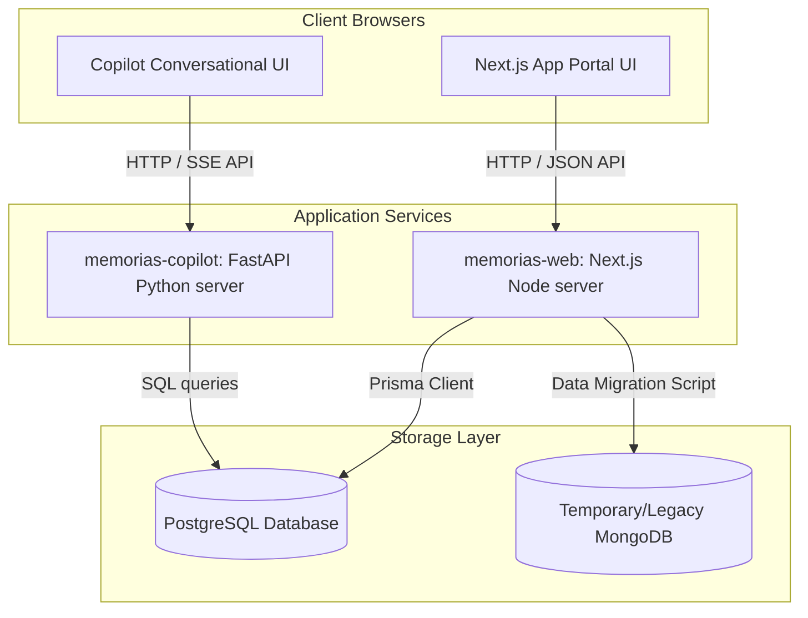

# About Memorias

Welcome to **Memorias**, a state-of-the-art scientific research repository and laboratory management portal. Memorias is designed to simplify and showcase academic work, including research publications, defended theses, active projects, scholarships, and members' profiles.

This portal is currently utilized actively by **LIFIA** (Laboratorio de Investigación y Formación en Informática Avanzada) to manage and catalog our research contributions and assets.

---

## 🤖 An Experiment in Agent-Based Software Development

Beyond its value as a practical, production-ready tool, Memorias is a **living experiment in agent-based software engineering**. 

### 🚀 Highlights of Our Development Journey
- **No Manual Code**: Not a single line of code in the migration, redesign, or implementation of this portal was manually written by a human.
- **Agent-First Mode**: Almost all software engineering, architecture, and feature implementations were carried out in **agent mode**, using autonomous AI coding agents operating directly on the codebase.
- **Minimal IDE Intervention**: The workspace was managed by agent instructions and command executions, representing a shift away from traditional, manual IDE code editing.

We invite researchers, developers, and visitors to learn both about the **scientific achievements of LIFIA** compiled within this portal, and about the **incredible potential of autonomous AI agents** in building modern, resilient, and enterprise-grade software.

---

## 🌍 Open Source & Collaboration

Interested in deploying Memorias for your own research laboratory, academic department, or study group? Or are you curious about exploring our agent-driven development workflows?

We warmly invite you to explore, clone, and use our open-source codebase! You can find the repository on GitHub:
👉 **[casco/memorias-migration-antigrativy](https://github.com/casco/memorias-migration-antigrativy)**

Feel free to fork the project, use it for your lab, submit issue reports, or share feedback on your own experiences with agent-built software systems!

---
## Few notes about the experience

It all started with a repo containing only the memorias-legacy folder; a dump of the Pharo/Seaside/VoyageMongo of [Memorias](https://github.com/lifia-unlp/memorias) and a locally running MongoDB with a replica of a Memorias production DB. My goal was to see what Antigravity could do with it. I did not expect much. Just told it something like "We have to migrate Memorias, built in Pharo/Seaside/VoyageMongo to something newer; you've got a real MongoDB running on localhost that we have to migrate". It was about 10 am on a Sunday. By 10 pm, I had (besides a terrible neck pain) the migrated site up and running (working data migration scripts too). Monday, Tuesday, Wednesday, some more hours to fine-tune the UI, add some functionality the original version did not have, and deploy it. I did not run out of credits, nor did I hit one of those "wait for five hours to continue". Let's say, 20 hrs in total. 

For Thursday, I had something more challenging planned. Completely migrate the UI to Material Design (eliminating Tailwind), improve the code design (not sure that matters), and achieve greater UI consistency. I first asked it to create a plain HTML mockup to make sure there was something good to base the migration on. Surprisingly, this required much more back-and-forth interaction than the previous phase. Then, I explained my goals (in a copilot-plan.md file) and asked it for feedback and to identify risks. After a few clarifications, I gave it the green light. It took the AI about 15 minutes to make most of the changes and use all of my allotted Gemini credit. I handed the task over to Claude models (I had some credit left). After a few more minutes, it finished implementing the changes and started a round of build-fix cycle. About then of these until it ran out of Claude credits. Most of the problems were due to version mismatches between the code it wrote and the current versions of the libraries it uses (or so it reports). Not sure I could have given better instructions to avoid hitting these problems that late in the cycle. Let's see what happens when I get my credits replenished, and ask the AI to continue ... 

---

## 🗺️ Project Blueprint & Architecture

The Memorias workspace is organized as a monorepo consisting of three main modules:

### Module Breakdown:
1. **[memorias-web](file:///Volumes/X-Wing/casco/Development/memorias-migration-antigrativy/memorias-web)**: The primary research portal web application. Built with Next.js (TypeScript), Material UI design system, Prisma ORM, and PostgreSQL. It contains data migration translation scripts from legacy database engines.
2. **[memorias-copilot](file:///Volumes/X-Wing/casco/Development/memorias-migration-antigrativy/memorias-copilot)**: The intelligent research assistant. Built with Python FastAPI, Astral `uv`, and OpenAI API as the backend, and standard ES-Module Vanilla JS/CSS as the front-end chat interface.
3. **[memorias-legacy](file:///Volumes/X-Wing/casco/Development/memorias-migration-antigrativy/memorias-legacy)**: Historical codebase (Pharo / Seaside Smalltalk & Voyage MongoDB) preserved for references and legacy compliance.

---

## 🚦 Quick Navigation Map

Use the index below to instantly locate instructions for deployment, local development, and core system functionalities:

| What are you trying to do? | Document & Location | Description |
|---|---|---|
| 🚀 **Deploy in Production** | **[DEPLOYMENT.md](file:///Volumes/X-Wing/casco/Development/memorias-migration-antigrativy/DEPLOYMENT.md)** | Step-by-step production deployment using Docker / Docker Compose. |
| 💻 **Set up Local Development** | **[DEVELOPMENT.md](file:///Volumes/X-Wing/casco/Development/memorias-migration-antigrativy/DEVELOPMENT.md)** | Comprehensive instructions for local database running, local servers, and linting. |
| 🔄 **Run Data Migration** | **[migration.md](file:///Volumes/X-Wing/casco/Development/memorias-migration-antigrativy/memorias-web/docs/migration.md)** | Technical detail of the MongoDB-to-PostgreSQL two-pass translation engine. |
| 🤖 **Develop the AI Copilot** | **[copilot/README.md](file:///Volumes/X-Wing/casco/Development/memorias-migration-antigrativy/memorias-copilot/README.md)** | Setup commands, FastAPI endpoints, design guidelines, and rules for the copilot. |
| 📝 **Check Metadata Fields** | **[bibtex-fields.md](file:///Volumes/X-Wing/casco/Development/memorias-migration-antigrativy/memorias-web/docs/bibtex-fields.md)** | Specifications of BibTeX schemas and data validation for academic records. |
| 🧪 **Read Testing Strategy** | **[testing-strategy.md](file:///Volumes/X-Wing/casco/Development/memorias-migration-antigrativy/memorias-web/docs/testing-strategy.md)** | Overview of Playwright, Vitest, and backend coverage suites. |
