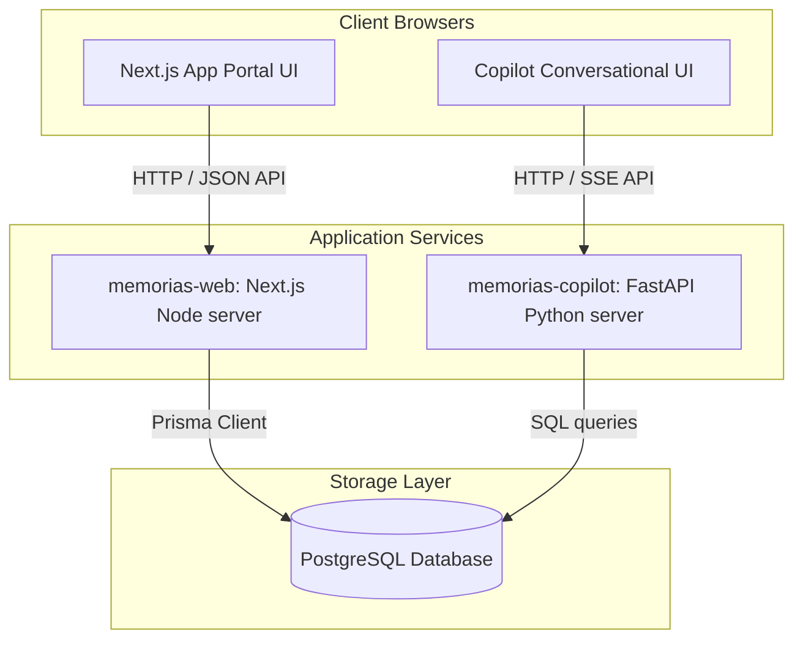

# About Memorias

Welcome to **Memorias**, a state-of-the-art scientific research repository and laboratory management portal. Memorias is designed to simplify and showcase academic work, including research publications, defended theses, active projects, scholarships, and members' profiles.

This portal is currently utilized actively by **LIFIA** (Laboratorio de Investigación y Formación en Informática Avanzada) to manage and catalog our research contributions and assets.

---

## 🤖 An Experiment in Agent-Based Software Development

Beyond its value as a practical, production-ready tool, Memorias is a **living experiment in agent-based software engineering**. 

### 🚀 Highlights of Our Development Journey
- **No Manual Code**: Not a single line of code in the migration, redesign, or implementation of this portal was manually written by a human.
- **Agent-First Mode**: Almost all software engineering, architecture, and feature implementations were carried out in **agent mode**, using autonomous AI coding agents operating directly on the codebase.
- **Minimal IDE Intervention**: The workspace was managed by agent instructions and command executions, representing a shift away from traditional, manual IDE code editing.

We invite researchers, developers, and visitors to learn both about the **scientific achievements of LIFIA** compiled within this portal, and about the **incredible potential of autonomous AI agents** in building modern, resilient, and enterprise-grade software.

---

## 🌍 Open Source & Collaboration

Interested in deploying Memorias for your own research laboratory, academic department, or study group? Or are you curious about exploring our agent-driven development workflows?

We warmly invite you to explore, clone, and use our open-source codebase! You can find the repository on GitHub:
- **[lifia-unlp/memorias](https://github.com/lifia-unlp/memorias)** (Primary repository)

Feel free to fork the project, use it for your lab, submit issue reports, or share feedback on your own experiences with agent-built software systems!

---

## 🗺️ Project Blueprint & Architecture

The Memorias workspace is organized as a monorepo consisting of two main modules:

```mermaid
graph TD
    subgraph Client [Client Browsers]
        UI[Next.js App Portal UI]
        Chat[Copilot Conversational UI]
    end

    subgraph AppServer [Application Services]
        Web[memorias-web: Next.js Node server]
        Copilot[memorias-copilot: FastAPI Python server]
    end

    subgraph Database [Storage Layer]
        PG[(PostgreSQL Database)]
    end

    UI -->|HTTP / JSON API| Web
    Chat -->|HTTP / SSE API| Copilot
    Web -->|Prisma Client| PG
    Copilot -->|SQL queries| PG
```

### Module Breakdown:
1. **[memorias-web](file:///Users/casco/Development/memorias-migration-antigrativy/memorias-web)**: The primary research portal web application. Built with Next.js (TypeScript), Material UI design system, Prisma ORM, and PostgreSQL.
2. **[memorias-copilot](file:///Users/casco/Development/memorias-migration-antigrativy/memorias-copilot)**: The intelligent research assistant. Built with Python FastAPI, Astral `uv`, and OpenAI API as the backend, and standard ES-Module Vanilla JS/CSS as the front-end chat interface.

---

## 🚦 Quick Navigation Map

Use the index below to instantly locate instructions for deployment, local development, and core system functionalities:

| What are you trying to do? | Document & Location | Description |
|---|---|---|
| 🚀 **Deploy in Production** | **[DEPLOYMENT.md](file:///Users/casco/Development/memorias-migration-antigrativy/DEPLOYMENT.md)** | Step-by-step production deployment using Docker / Docker Compose. |
| 💻 **Set up Local Development** | **[DEVELOPMENT.md](file:///Users/casco/Development/memorias-migration-antigrativy/DEVELOPMENT.md)** | Comprehensive instructions for local database running, local servers, and linting. |
| 🤖 **Develop the AI Copilot** | **[copilot/README.md](file:///Users/casco/Development/memorias-migration-antigrativy/memorias-copilot/README.md)** | Setup commands, FastAPI endpoints, design guidelines, and rules for the copilot. |
| 📝 **Check Metadata Fields** | **[bibtex-fields.md](file:///Users/casco/Development/memorias-migration-antigrativy/memorias-web/docs/bibtex-fields.md)** | Specifications of BibTeX schemas and data validation for academic records. |
| 🧪 **Read Testing Strategy** | **[testing-strategy.md](file:///Users/casco/Development/memorias-migration-antigrativy/memorias-web/docs/testing-strategy.md)** | Overview of Playwright, Vitest, and backend coverage suites. |
| ✉️ **Configure Notifications** | **[notifications.md](file:///Users/casco/Development/memorias-migration-antigrativy/memorias-web/docs/notifications.md)** | Comprehensive guide to immediate alerts, scheduled digests, and SMTP setup. |
