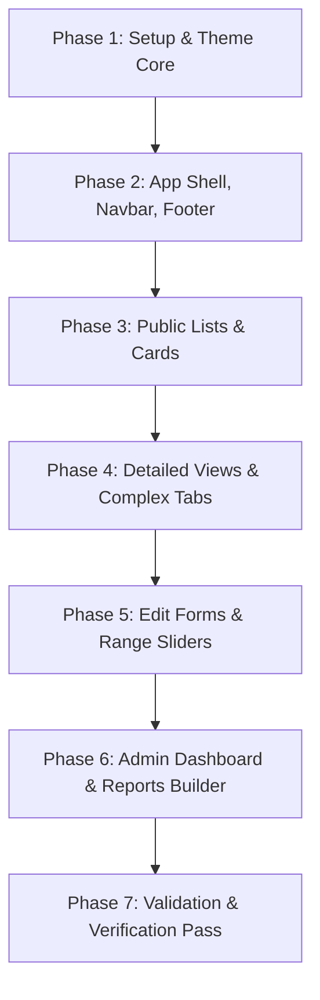

# AI Migration Guide: Dropping Tailwind CSS for Material-UI (MUI)

This document is the official technical brief and implementation roadmap for migrating the **Memorias** research portal (`memorias-web` Next.js application) from utility-first Tailwind CSS to a standardized, centralized **Material-UI (MUI)** theme and components.

This guide leverages the design tokens and structural patterns validated in the `memorias-mui-mockup` static prototype.

---

## 1. Migration Scope & Goals

> [!NOTE]
> **Primary Objective:** Drop Tailwind CSS completely from `memorias-web`. Remove all Tailwind dependencies, clean up CSS classes, and rebuild the UI structure using high-fidelity **Material-UI v5+** React components under a unified theme.

### Goals
* **Drop Tailwind & Purge Bloat:** Eliminate Tailwind configuration, styles, and custom utilities to decrease bundle size and prevent styling collision.
* **Centralized MUI Theme:** Restructure typography scales, elevations, borders, and colors within a unified `theme.ts` file rather than applying ad-hoc utility classes.
* **Preserve Academic Terminology & Data Schema:** Keep all terminology (*CIC*, *CONICET*, *welcome_title*) and supervisor/fellow relationships fully aligned with the existing database schemas. No fields should be renamed or removed.
* **Responsive, Editorial Presentation:** Optimize readability. Academic portal layouts should feel legible, making extensive use of structured margins, modern typography hierarchy, and clear groupings.
* **Premium Client Interactions:** Implement custom elements like the BibTeX Raw Auto-Parser, dynamic citation style selectors, and CSS/JS-based tabs.

---

## 2. Screen Inventory & Route Mapping

The static mockup models **12 core visual layouts** covering all primary route paths of the application. The following table maps the mockup HTML files to their corresponding Next.js route structures:

| Mockup HTML File | Next.js App Router Route | Target Audience & Authentication Scope | Key Features & Interactions |
| :--- | :--- | :--- | :--- |
| `index.html` | `/` | Guest / Admin (Anonymous / Authenticated) | Hero banner, Tag Cloud, Featured publications grid, Projects/Theses cards. |
| `members.html` | `/members` | Guest / Curator / Admin | Grid list of researcher cards, agency filters (CONICET/CIC), pagination. |
| `member-detail.html` | `/members/[id]` | Guest / Curator / Admin | Two-column details, bilingual biography tabs (ES/EN), publications/projects list. |
| `member-form.html` | `/members/new` \| `/[id]/edit` | Curator / Admin (Required Auth) | Outlined inputs, agency selector dropdowns, switch toggles, save/cancel. |
| `projects.html` | `/projects` | Guest / Curator / Admin | Project funding listing, active state filters, tag search. |
| `project-detail.html` | `/projects/[id]` | Guest / Curator / Admin | Sidebar metadata (funding, dates, directors), abstract panel, member matrix table. |
| `project-form.html` | `/projects/new` \| `/[id]/edit` | Curator / Admin (Required Auth) | Director selectors, date widgets, multiselect tags, checkbox grids. |
| `theses.html` | `/theses` | Guest / Curator / Admin | Dissertations grid list, academic level filters, completion progress meters. |
| `thesis-detail.html` | `/theses/[id]` | Guest / Curator / Admin | Defense grade chips, student/jury table, abstract panel. |
| `thesis-form.html` | `/theses/new` \| `/[id]/edit` | Curator / Admin (Required Auth) | Completion range slider, advisor selects, grade/date widgets. |
| `scholarships.html` | `/scholarships` | Guest / Curator / Admin | Sponsor/agency filtering, postdoctoral & doctoral card lists. |
| `scholarship-detail.html` | `/scholarships/[id]` | Guest / Curator / Admin | Scholarship metadata panel, supervisors details list. |
| `scholarship-form.html` | `/scholarships/new` \| `/[id]/edit` | Curator / Admin (Required Auth) | Type selects, start/end dates, sponsor inputs. |
| `publications.html` | `/publications` | Guest / Curator / Admin | Bibliographical grid list, interactive citation selector (APA/IEEE/BibTeX). |
| `publication-detail.html` | `/publications/[id]` | Guest / Curator / Admin | Clipboard copy tool, PDF downloads, tabs, abstract, associated projects. |
| `publication-form.html` | `/publications/new` \| `/[id]/edit` | Curator / Admin (Required Auth) | **BibTeX Auto-Parser**, co-authors selects, PDF file uploads, toggles. |
| `reports.html` | `/reports` | Curator / Admin (Required Auth) | Statistical metric cards, progress bar charts, **Report Builder & Preview Table**. |
| `admin.html` | `/admin` | Admin (Required Auth) | System config forms, Users permission matrix, Tag curation console, Audit logs. |
| `auth.html` | `/auth` | Anonymous Guest | Elegant centered Material Card for login. |
| `preferences.html` | `/preferences` | Curator / Admin (Required Auth) | Account settings, default citation picker, notifications settings toggles. |
| `about.html` | `/about` | Guest / Curator / Admin | Editorial overview, transition rationale description, domain schemas. |
| `pending-activation.html` | `/auth/pending` | Anonymous Registered User | Registration confirmation alert, activation status, admin contact. |

---

## 3. Centralized MUI Theme Configuration

Create a centralized Material Theme in the Next.js portal (e.g. `src/theme/theme.ts` or `src/styles/theme.ts`) that matches the validated light-theme CSS tokens.

```typescript
import { createTheme } from '@mui/material/styles';

export const theme = createTheme({
  palette: {
    mode: 'light',
    primary: {
      main: '#1976d2',
      dark: '#1565c0',
      light: 'rgba(25, 118, 210, 0.08)',
    },
    secondary: {
      main: '#9c27b0',
      dark: '#7b1fa2',
      light: 'rgba(156, 39, 176, 0.08)',
    },
    background: {
      default: '#f8fafc',
      paper: '#ffffff',
    },
    text: {
      primary: '#1e293b',
      secondary: '#64748b',
      disabled: '#cbd5e1',
    },
    success: {
      main: '#2e7d32',
      light: 'rgba(46, 125, 50, 0.08)',
    },
    warning: {
      main: '#ed6c02',
      light: 'rgba(237, 108, 2, 0.08)',
    },
    error: {
      main: '#d32f2f',
      light: 'rgba(211, 47, 47, 0.08)',
    },
    info: {
      main: '#0288d1',
      light: 'rgba(2, 136, 209, 0.08)',
    },
    divider: '#e2e8f0',
  },
  typography: {
    fontFamily: [
      'Roboto',
      'Outfit',
      '-apple-system',
      'BlinkMacSystemFont',
      '"Segoe UI"',
      'sans-serif',
    ].join(','),
    h1: {
      fontFamily: 'Outfit, Roboto, sans-serif',
      fontWeight: 800,
      fontSize: '2.5rem',
      letterSpacing: '-0.02em',
      color: '#1e293b',
    },
    h2: {
      fontFamily: 'Outfit, Roboto, sans-serif',
      fontWeight: 800,
      fontSize: '1.75rem',
      letterSpacing: '-0.01em',
      color: '#1e293b',
    },
    h3: {
      fontFamily: 'Outfit, Roboto, sans-serif',
      fontWeight: 700,
      fontSize: '1.25rem',
      color: '#1e293b',
    },
    body1: {
      fontSize: '0.925rem',
      lineHeight: 1.6,
      color: '#1e293b',
    },
    body2: {
      fontSize: '0.815rem',
      color: '#64748b',
    },
    button: {
      fontFamily: 'Outfit, Roboto, sans-serif',
      fontWeight: 700,
      textTransform: 'uppercase',
      letterSpacing: '0.5px',
      fontSize: '0.815rem',
    },
  },
  shape: {
    borderRadius: 8, // maps to var(--radius-sm)
  },
  shadows: [
    'none',
    '0px 2px 1px -1px rgba(0,0,0,0.1), 0px 1px 1px 0px rgba(0,0,0,0.07), 0px 1px 3px 0px rgba(0,0,0,0.06)', // dp1
    '0px 3px 1px -2px rgba(0,0,0,0.1), 0px 2px 2px 0px rgba(0,0,0,0.07), 0px 1px 5px 0px rgba(0,0,0,0.06)', // dp2
    'none',
    '0px 2px 4px -1px rgba(0,0,0,0.1), 0px 4px 5px 0px rgba(0,0,0,0.07), 0px 1px 10px 0px rgba(0,0,0,0.06)', // dp4
    ...Array(3).fill('none'), // filler shadows
    '0px 5px 5px -3px rgba(0,0,0,0.1), 0px 8px 10px 1px rgba(0,0,0,0.07), 0px 3px 14px 2px rgba(0,0,0,0.06)', // dp8
    ...Array(7).fill('none'),
    '0px 8px 10px -5px rgba(0,0,0,0.1), 0px 16px 24px 2px rgba(0,0,0,0.07), 0px 6px 30px 5px rgba(0,0,0,0.06)', // dp16
    ...Array(8).fill('none'),
  ] as any,
  components: {
    MuiCard: {
      styleOverrides: {
        root: {
          borderRadius: 12, // var(--radius-md)
          border: '1px solid #e2e8f0',
          boxShadow: '0px 2px 1px -1px rgba(0,0,0,0.1), 0px 1px 1px 0px rgba(0,0,0,0.07), 0px 1px 3px 0px rgba(0,0,0,0.06)',
          transition: 'all 0.25s cubic-bezier(0.4, 0, 0.2, 1)',
          '&:hover': {
            boxShadow: '0px 2px 4px -1px rgba(0,0,0,0.1), 0px 4px 5px 0px rgba(0,0,0,0.07), 0px 1px 10px 0px rgba(0,0,0,0.06)',
            borderColor: '#94a3b8',
            transform: 'translateY(-2px)',
          },
        },
      },
    },
    MuiButton: {
      styleOverrides: {
        root: {
          borderRadius: 4,
          padding: '8px 16px',
        },
        containedPrimary: {
          backgroundColor: '#1976d2',
          color: '#ffffff',
          '&:hover': {
            backgroundColor: '#1565c0',
          },
        },
        outlinedPrimary: {
          color: '#1976d2',
          borderColor: 'rgba(25, 118, 210, 0.5)',
          '&:hover': {
            backgroundColor: 'rgba(25, 118, 210, 0.08)',
            borderColor: '#1976d2',
          },
        },
      },
    },
    MuiTextField: {
      defaultProps: {
        variant: 'outlined',
        size: 'medium',
      },
    },
  },
});
```

---

## 4. Code Translation Map: Tailwind to MUI

Use the following component translation dictionary to clean utility CSS structures in the TSX files and replace them with standard semantic Material components:

| Visual Design Pattern | Legacy Tailwind Implementation | Modern Material-UI (MUI) Implementation |
| :--- | :--- | :--- |
| **Grid Layout (3 cols)** | `<div class="grid grid-cols-1 md:grid-cols-3 gap-6">` | `<Grid container spacing={3}>` <br>`  <Grid item xs={12} md={4}>` |
| **Main Container** | `<div class="max-w-6xl mx-auto px-4 w-full">` | `<Container maxWidth="lg">` |
| **Shadow Card** | `<div class="bg-white border border-slate-200 rounded-lg p-6 shadow-sm">` | `<Card sx={{ p: 3 }}>` |
| **Typography Scale** | `<h1 class="text-3xl font-extrabold tracking-tight text-slate-800">` | `<Typography variant="h1">` |
| **Action Outlined Button** | `<button class="border border-blue-500 text-blue-500 hover:bg-blue-50/50 px-4 py-2 rounded">` | `<Button variant="outlined" color="primary">` |
| **Form Inputs** | `<input type="text" class="w-full border border-slate-200 rounded px-3 py-2 outline-none focus:border-blue-500">` | `<TextField fullWidth variant="outlined" label="Field Title" />` |
| **Toggle Switches** | `<input type="checkbox" class="sr-only"> ... custom slide absolute div` | `<FormControlLabel control={<Switch checked={...} onChange={...} />} label="..." />` |
| **Status Chip** | `<span class="bg-green-50 text-green-700 border border-green-200 text-xs px-2 py-1 rounded-sm">` | `<Chip label="..." color="success" size="small" variant="outlined" />` |
| **Linear Progress** | `<div class="w-full bg-slate-200 h-1 rounded"><div class="bg-blue-600 h-1 rounded" style="width: 50%"></div></div>` | `<LinearProgress variant="determinate" value={50} />` |
| **Dense Lists & Tables** | `<table class="w-full text-left text-sm border border-slate-200"> ... <thead>` | `<TableContainer component={Paper}>`<br>`  <Table size="small">` |
| **Tabs Interaction** | Complex state controllers switching absolute active visibility layers | `<Tabs value={...} onChange={...}>`<br>`  <Tab label="..." />` |

---

## 5. Tailwind Deprecation & Purge Sequence

To clean the legacy Tailwind code and configure the Next.js setup to compile with MUI, execute the following steps:

1. **Remove Packages:**
   Uninstall the Tailwind core and PostCSS pre-processors:
   ```bash
   npm uninstall tailwindcss postcss autoprefixer
   ```

2. **Clean Configuration Files:**
   Delete obsolete static config files from the workspace root:
   ```bash
   rm -f tailwind.config.js postcss.config.js tailwind.config.ts
   ```

3. **Reset Global CSS Stylesheet:**
   Locate your main CSS entry point (e.g. `src/styles/globals.css` or `styles/globals.css`). Remove Tailwind directives and reduce it to standard base resets:
   ```css
   /* src/styles/globals.css */
   @import url('https://fonts.googleapis.com/css2?family=Outfit:wght@300;400;500;600;700;800&family=Roboto:wght@300;400;500;700;900&display=swap');

   * {
     box-sizing: border-box;
     margin: 0;
     padding: 0;
   }

   body {
     background-color: #f8fafc;
     color: #1e293b;
     font-family: 'Roboto', 'Outfit', sans-serif;
     -webkit-font-smoothing: antialiased;
   }
   ```

4. **Verify MUI Context Providers:**
   Wrap the root Next.js layout (`src/app/layout.tsx` or `src/pages/_app.tsx`) with MUI's `<ThemeProvider>` and `<CssBaseline>`:
   ```tsx
   import { ThemeProvider } from '@mui/material/styles';
   import CssBaseline from '@mui/material/CssBaseline';
   import { theme } from '../theme/theme';
   import '../styles/globals.css';

   export default function RootLayout({ children }: { children: React.ReactNode }) {
     return (
       <html lang="en">
         <body>
           <ThemeProvider theme={theme}>
             <CssBaseline />
             {children}
           </ThemeProvider>
         </body>
       </html>
     );
   }
   ```

---

## 6. Incremental Migration Phases

To minimize regressions, carry out the migration in the following incremental sequence:



### Phase 1: Dependency Integration & Purging
* Purge Tailwind dependencies and configurations as detailed in Section 5.
* Install MUI libraries: `@mui/material @emotion/react @emotion/styled`.
* Setup `theme.ts` design system tokens.

### Phase 2: App Shell Foundations
* Migrate the main header toolbar and dropdown lists (`index.html` navigation rules).
* Implement the responsive AppBar collapse drawer.
* Build the institutional footer elements.

### Phase 3: Public Dashboard & Entity Cards
* Rewrite the portal landing dashboard.
* Build the keyword search filters, active lists, and cards for the 5 entity families:
  1. Members Card List (`members.html`)
  2. Projects Card List (`projects.html`)
  3. Theses Card List (`theses.html`)
  4. Scholarships Card List (`scholarships.html`)
  5. Publications Card List with citation views switcher (`publications.html`)

### Phase 4: Dense Tabbed Detail Views
* Rebuild `member-detail.html`, `project-detail.html`, `thesis-detail.html`, `scholarship-detail.html`, and `publication-detail.html`.
* Implement the MUI `<Tabs>` panels for bilingual descriptions.
* Configure quick action buttons (Edit, Delete, Copy to Clipboard).

### Phase 5: Curator & Admin Forms
* Refactor the creation and editing forms.
* Configure MUI `<TextField>` widgets with floating label animations.
* Implement the advisors multiselect selectors, data controllers, and switches.
* **CRITICAL:** Re-implement the client-side **BibTeX Auto-Parser** in `/publications/new` to parse clipboard structures and populate inputs programmatically.

### Phase 6: Analytical Reports & Administration Panels
* Rebuild `reports.html` statistical card matrix, CSS-based linear progress bar meters, and the query parameters builder table.
* Rebuild `admin.html` admin panels:
  - Users matrix table with role assignment dropdowns and approval triggers.
  - Curation tags taxonomy manager.
  - Audit feed logging tables.

### Phase 7: Validation & Optimization Pass
* Audit performance and responsive breakpoints.
* Check navigation link pipelines, data schema attributes, and accessibility configurations.
