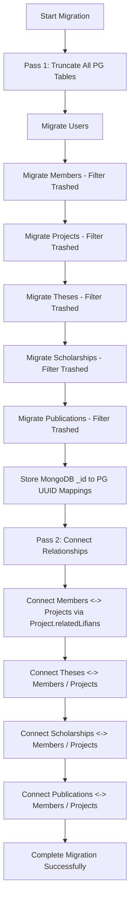

# Database Migration Guide: MongoDB to PostgreSQL

This guide provides permanent technical documentation for the data migration system implemented to transfer legacy research portal data from **MongoDB (Voyage / Pharo Smalltalk)** to the new **PostgreSQL (Prisma)** database.

---

## 1. Prerequisites & Stack Details

- **Legacy Database**: MongoDB (running locally, database name: `lifiometro`).
- **Target Database**: PostgreSQL (using Prisma ORM 7.8.0).
- **Prisma 7 Compatibility**: Prisma 7 does not support `url` inside `schema.prisma`. It relies entirely on driver adapters for direct TCP connections. We utilize `pg` and `@prisma/adapter-pg` inside `src/lib/prisma.ts` to instantiate a native TCP connection pool.

---

## 2. Ingestion & Transformation Rules

To ensure a clean, high-fidelity relational schema, the migration script applies a comprehensive set of filtering, cleaning, and de-duplication rules:

### A. Trashed / Logically Deleted Records (CRITICAL)
In the legacy Smalltalk app, logical deletions were managed by marking elements as `trashed = true`. In the new schema, we drop this field in favor of true PostgreSQL referential integrity.
- **Rule**: All queries on MongoDB collections explicitly exclude trashed entries:
  ```typescript
  collection.find({ trashed: { $ne: true } })
  ```
- This guarantees only active records are migrated (excluding, for example, the 46 trashed theses identified in legacy storage).

### B. User Normalization & Collision Avoidance
- **Presence Check**: Skip accounts that are missing email addresses.
- **De-duplication**: Normalized all email inputs to lowercase and track inserted addresses in a `Set`. If an email is case-insensitively duplicated in MongoDB, only the first record is migrated to satisfy the PostgreSQL `@unique` constraint.
- **Names**: Splitting full names (e.g. `fullname` -> `firstName`, `lastName`).

### C. Unique Slug Generation
- Generates beautiful, SEO-friendly, wordpress-style alphanumeric slugs from record names.
- Tracks generated slugs in a global `Set` during migration and automatically appends a numeric counter suffix (e.g. `carlos-mendoza-1`) if any naming collisions occur across tables.

### D. Fields & Formats Adaptation
- **Dates**: Mapped to PostgreSQL `DATE` types (`@db.Date`) allowing simple date-picker integration.
- **Progress Tracker**: Parsed string percentages (e.g. `"100%"` or `"60%"`) into numeric `Int` values in steps of 10 (`100`, `60`, etc.).
- **Publications (BibTex)**: Ingested nested `BibtexReference` entries by extracting key indexable fields (`title`, `authors`, `year`, `type`, `citationKey`) and stored the complete, raw JSON structure inside the `bibtexData` field to avoid any data loss.

---

## 3. The Two-Pass Migration Architecture

To successfully establish foreign-key relations without causing circular dependency lockups, `scripts/migrate.ts` executes a two-pass cycle:



---

## 4. How to Execute & Verify the Migration

### A. Run the Migration
To wipe the PostgreSQL tables and run the full migration, execute:
```bash
npx tsx scripts/migrate.ts
```

### B. Run Verification Sanity Checks
We have created a dedicated checking script that counts all PostgreSQL records and validates their cross-relationships:
```bash
npx tsx scripts/verify-pg.ts
```

### Expected Clean Stats (Excluding Trashed Documents):
- **Users**: 30 (Filtered duplicates / nulls)
- **Members**: 50
- **Projects**: 50
- **Theses**: 149 (Cleaned 46 trashed items!)
- **Scholarships**: 64
- **Publications**: 296

---

## 5. Development Utility Locations

- **Database Client Singleton**: [prisma.ts](file:///Users/casco/Development/memorias-migration-antigrativy/memorias-web/src/lib/prisma.ts)
- **Database Schema**: [schema.prisma](file:///Users/casco/Development/memorias-migration-antigrativy/memorias-web/prisma/schema.prisma)
- **Migration Logic Script**: [migrate.ts](file:///Users/casco/Development/memorias-migration-antigrativy/memorias-web/scripts/migrate.ts)
- **Sanity Verification Script**: [verify-pg.ts](file:///Users/casco/Development/memorias-migration-antigrativy/memorias-web/scripts/verify-pg.ts)
